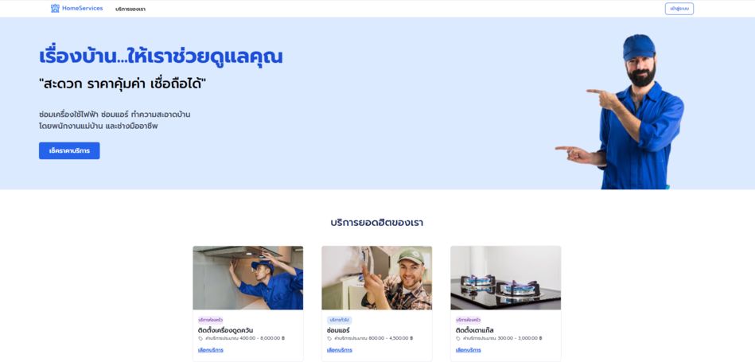
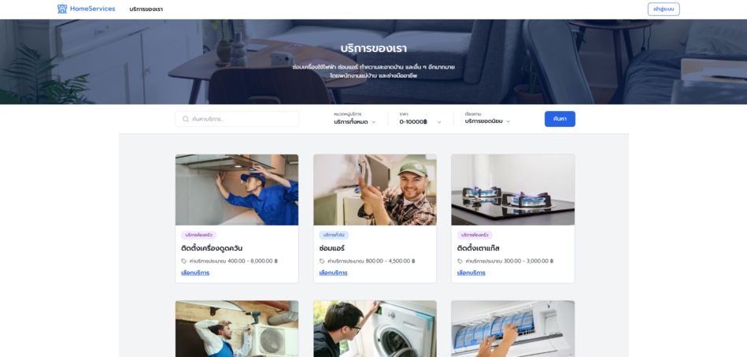
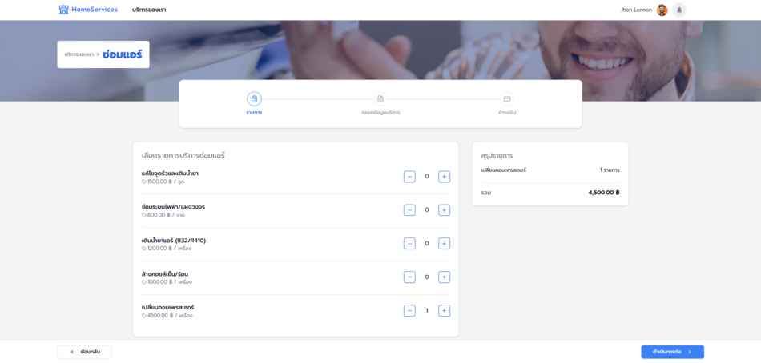
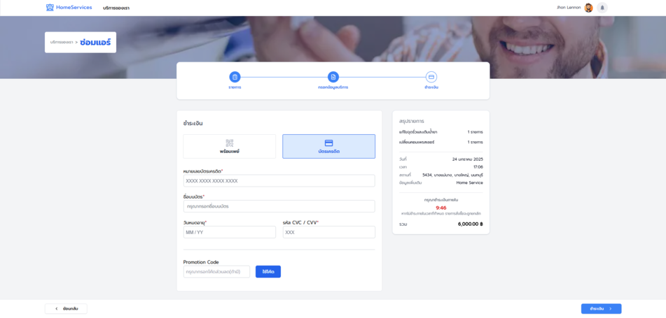
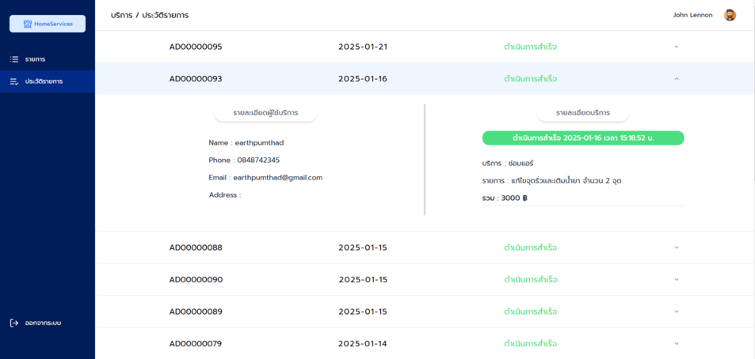
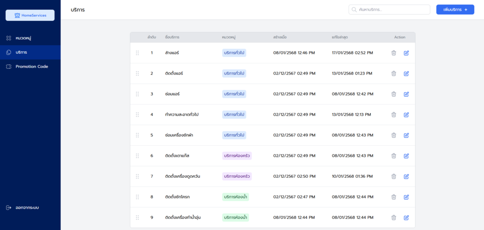

# Home Service Project

### • **This project involves the development of an application to manage various home services, such as cleaning services, repair services, and other services to facilitate users.**

## Live Demo Link

[ https://home-service-finalproject.vercel.app/ ]

## Project Overview

- **Main Features:**
  - Booking various services such as cleaning, air conditioning repair, plumbing repair, etc.
  - Searching for services by name, price, and service type
  - Booking management
  - Administration system management
  - Member system and authentication
  - Payment system
  - Service status system

## Application Screenshots

### Homepage



### Service List Page



### Service Detail Page



### Payment Page



### Booking Management Page



### Admin Dashboard



## Tech Stack

- **Primary Language:** TypeScript
- **Frontend:**
  - Framework: Next.js
  - UI Components: Shadcn/UI
  - CSS Styling: Tailwind CSS
  - Form State Management: React Hook Form
  - State Management: React Hooks
  - Data Fetching: Axios
- **Backend:**
  - Cloud Database: Supabase
  - SQL Database: PostgreSQL (via Supabase)
  - Authentication: Supabase Auth
  - File Storage: Supabase Storage
  - API Documentation: Google Docs + Swagger
  - ERD Diagram: Diagrams.net

## Architecture

This project utilizes a client-server architecture:

- **Client (Frontend):** Operates on the user's browser, responsible for displaying the UI and handling user interactions.
- **Server (Backend):** Runs on Supabase, responsible for data management, processing, and database connectivity.

## Installation and Usage

1.  Clone repository: `git@github.com:earthfm1670/home_service_finalproject.git`
2.  Install dependencies: `npm install` หรือ `yarn install`
3.  Run the project: `npm run dev` หรือ `yarn run dev`

### Demo Credentials

To try the live demo, use the following credentials:

**Admin role**

- **Username:** admin001@example.com
- **Password:** demo1234567890

**Handyman role**

- **Username:** fixer000@example.com
- **Password:** demo1234567890

**Customer role**

- You can register directly on the website.

##

```markdown
# Project Structure

home_service_finalproject/
├── public/                     # Static assets (images, svgs, fonts)
│ └── images/
├── src/                        # Main source code directory
│ ├── components/               # React components
│ ├── context/                  # Context API contexts
│ ├── lib/                      # Utility functions and helper libraries
│ ├── middleware-stack/         # Middleware & authentication functions
│ ├── pages/                    # Next.js pages - Application routing
│ │ ├── api/                    # API routes - Backend API endpoints
│ │ ├── admincategory/          # Admin service category management pages
│ │ ├── adminlogin/             # Admin login page
│ │ ├── adminpromotioncode/     # Admin promotion code management pages
│ │ ├── adminservice/           # Admin service data management pages
│ │ ├── customerservice/        # Customer service pages (e.g., FAQ, Contact Us)
│ │ ├── fonts/                  # Project fonts
│ │ ├── handyman/               # Handyman (service provider) pages (e.g., profile, reports)
│ │ ├── login/                  # User login page
│ │ ├── logout/                 # User logout page
│ │ ├── payment/                # Payment management pages
│ │ ├── paymentsuccess/         # Payment success page
│ │ ├── register/               # User registration page
│ │ ├── serviceinfo/            # Service details page
│ │ ├── servicelist/            # Service list page
│ │ ├── index.tsx               # Website homepage
│ │ └── \_app.tsx               # Custom App component - Layout and global styles
│ ├── styles/                   # CSS styles
│ │ ├── globals.css
│ ├── types/                    # TypeScript types/interfaces
│ ├── utils/                    # Utility functions (helpers, constants)
│ └── middleware.ts             # Global middleware (if applicable, moved to src)
├── .eslintrc.json              # ESLint configuration
├── .gitignore                  # Git ignore file
├── components.json             # Component library configuration (if used)
├── next-env.d.ts               # Next.js environment declarations
├── next.config.ts              # Next.js configuration
├── package-lock.json           # npm lockfile
├── package.json                # Package configuration
├── postcss.config.mjs          # PostCSS configuration
├── tailwind.config.ts          # Tailwind CSS configuration
├── tsconfig.json               # TypeScript configuration
└── README.md                   # Project documentation
```

## Developers and Contact Information

- **Team Members:**
  - **Pumthad Kaewmongkolsri**
    - [GitHub](https://github.com/earthfm1670)
    - [LinkedIn](https://www.linkedin.com/in/pumthadk/)
  - **Natthanat Chuayriang**
    - [GitHub](https://github.com/PotterWinter)
    - [LinkedIn](https://www.linkedin.com/in/korn-natthanat/)
  - **Thanapat Tongyam**
    - [GitHub](https://github.com/Thanapat1502)
    - [LinkedIn](https://www.linkedin.com/in/thanapat-tongyam-a75121336/)
  - **Kittisak Saengsri**
    - [GitHub](https://github.com/Thekit789)
    - [LinkedIn](https://www.linkedin.com/in/kittisak-saengsri/)
  - **Wannasingh Khansophon**
    - [GitHub](https://github.com/Wannasingh)
    - [LinkedIn](https://www.linkedin.com/in/wannasingh/)

**--> If you have any questions or need further assistance, please feel free to reach out through the provided contact information.**
